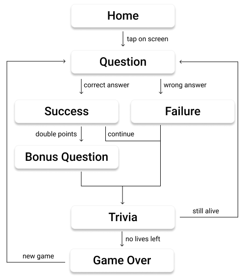

# Kwizapp Ionic React Frontend

<p align="center">
  <a href="https://kwizapp.github.io" target="blank"></a>
</p>

## Development

install npm packages

```bash
npm i
```

### Styles

Build [tailwind](https://tailwindcss.com/) styles

```bash
# once
npm run build:style

# watch mode
npm run dev:style
```

### Start Application

This is the frontend of the `kwizapp`. It depends on a few services (APIs) in order to work properly:

- [`poster-service`](https://github.com/kwizapp/poster-service): provides movie poster image urls for IMDb ids
- [`metadata-service`](https://github.com/kwizapp/metadata-service): provides movie metadata for IMDb ids
- [`nest-api`](https://github.com/kwizapp/nest-api): main graphql API (get queried by the frontend)

1. Start Poster API (see corresponding [README](https://github.com/kwizapp/poster-service))
2. Start Metadata API (see corresponding [README](https://github.com/kwizapp/metadata-service))
3. Start Nest API (see corresponding [README](https://github.com/kwizapp/nest-api))
4. Start Ionic React Frontend with `npm run dev`
5. Open app on PORT **3000** - http://localhost:3000/

### Component Documentation

The folder `styleguide` contains automatically generated documentation of all our react components.

Open the file `styleguide/index.html` in a browser to access the documentation. There are two sections: **Pages** and **UI Components**. The first sections describes the main components that are structured in terms of pages, whereas the second section documents the smaller UI components used in our application.

### Mobile Preview

For a mobile preview, use the browser's built-in features for that.

### User Flow

This is the general flow of the Kwizz game. The game ends once the user has no more lives left.


